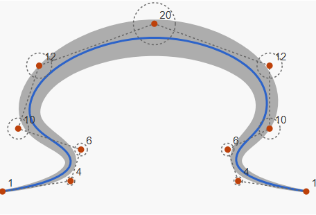

# Disk B-Spline Curves



This repository contains an interactive test harness for visualizing and experimenting with Disk B-Splines, a powerful technique for generating variable-width curves.

- [Disk B-Spline Curves Demo](https://bobpritchett.github.io/dbsc-svg/demo)

## Overview

Disk B-Spline Curves are a mathematical tool for generating smooth variable-width curves from a sequence of control disks. Each control disk consists of a center point and a radius, and the interpolation between these disks creates paths with continuously varying width. The implementation is particularly useful for:

- Drawing calligraphic strokes
- Creating natural-looking organic shapes
- Rendering smooth variable-width paths
- Designing vector graphics with aesthetic appeal

## Using the DiskBSpline Class

The `DiskBSpline` class in `index.js` is the core implementation for generating Disk B-Spline curves. Below is a brief guide on how to use this class, with examples referenced from `index.html`.

### Creating a DiskBSpline Instance

To create a new `DiskBSpline` instance, you need to provide an array of control disks. Each control disk is an object with `center` (an object with `x` and `y` properties) and `radius` properties.

```javascript
const controlDisks = [
  { center: { x: 50, y: 50 }, radius: 10 },
  { center: { x: 100, y: 100 }, radius: 20 },
  { center: { x: 150, y: 50 }, radius: 15 },
];

const diskBSpline = new DiskBSpline(controlDisks);
```

### Generating the Curve

Once you have a `DiskBSpline` instance, you can generate the curve by calling the `generateCurve` method. This method returns an array of points representing the curve.

```javascript
const curvePoints = diskBSpline.generateCurve();
```

### Visualizing the Curve

To visualize the curve, you can use the points returned by `generateCurve` to draw on a canvas or SVG element. Below is an example of how to draw the curve on an SVG element.

```javascript
const svg = document.getElementById("svgElement");
const pathData = curvePoints
  .map((point) => `${point[0]},${point[1]}`)
  .join(" L ");

const path = document.createElementNS("http://www.w3.org/2000/svg", "path");
path.setAttribute("d", `M ${pathData}`);
path.setAttribute("stroke", "black");
path.setAttribute("fill", "none");

svg.appendChild(path);
```

### Example Usage in index.html

Refer to the `index.html` file for more detailed examples of how to use the `DiskBSpline` class, including interactive examples where you can add control disks and visualize the resulting curve in real-time.

## Features

- **Interactive Demo**: Five different examples showcasing various applications
- **Visualization Controls**: Toggle visibility of skeleton paths, normal vectors, and control disks
- **Interactive Example**: Click to add control disks and visualize the resulting curve
- **Debug Logging**: Real-time feedback and diagnostic information
- **Pure JavaScript Implementation**: No external dependencies required

## Mathematics Background

This implementation leverages computational geometry to extend traditional B-Splines from point interpolation to disk interpolation for variable-width curves. It builds on research from:

- **[Artistic Brushstroke Representation and Animation with Disk B-Spline Curve](https://dl.acm.org/doi/10.1145/1178477.1178489)** [PDF](https://www.researchgate.net/profile/Xian-Xiao-10/publication/220982699_Artistic_brushstroke_representation_and_animation_with_disk_B-spline_curve/links/5630ce4508ae2df441bb7e98/Artistic-brushstroke-representation-and-animation-with-disk-B-spline-curve.pdf)
  _Authors_: Hock Soon Seah, Zhongke Wu, Feng Tian, Xian Xiao, Boya Xie  
  _Published_: ACE '05, 2005, pp. 88–93  
  _Publisher_: ACM, New York, NY, USA  
  _Keywords_: disk B-spline curve, brushstroke, animation  
  _Summary_: Introduces disk B-spline curves (DBSC) for modeling brushstrokes and animation, supporting 2D regions, centerline attributes, and efficient frame interpolation.

- **[Skeleton-Based Parametric 2-D Region Representation: Disk B-Spline Curves](https://doi.org/10.1109/MCG.2021.3069847)**  
  _Authors_: Zhongke Wu, Xingce Wang, Shaolong Liu, Quan Chen, Hock Soon Seah, Feng Tian  
  _Published_: IEEE Computer Graphics and Applications, 2021, vol. 41, no. 3, pp. 59–70  
  _Publisher_: IEEE  
  _Keywords_: splines, 2D displays, animation, geometry  
  _Summary_: Presents a skeleton-based approach using disk B-spline curves for parametric 2D region representation, enhancing computational modeling of shapes.

## How It Works

1. **Control Disks**: Each disk has a center point and radius
2. **B-Spline Interpolation**: The centerline (skeleton) is computed using traditional B-spline interpolation of center points
3. **Normal Vectors**: Perpendicular vectors to the curve are calculated at sample points
4. **Variable Width**: The curve boundary is generated by offsetting the skeleton by the interpolated radii along the normal vectors

## Getting Started

1. Clone this repository
2. Open `index.html` in any modern web browser
3. Experiment with the different examples
4. Try the interactive example to create your own disk B-spline curves

## Examples Included

1. **Simple Variable Width Curve**: Basic demonstration of the technique
2. **Complex Variable Width Curve**: More control points with varied radii
3. **Calligraphic Stroke**: Mimics the effect of a calligraphic pen
4. **Calligraphic Effect**: Dramatic width variation for artistic effects
5. **Interactive Curve**: Create your own curves by adding control disks

## Implementation Notes

- Implements cubic B-splines (degree 3) by default
- Uses uniform knot vectors for simplicity
- Approximates normals using finite differences
- Creates path outlines by offsetting along normal vectors
- Handles edge cases such as zero-length tangents and endpoint conditions

## AI Generation Notice

This code was mostly generated by Claude 3.7 Sonnet. This problem was one of my test cases for AI coding and I tried various AI engines and prompts, providing
PDFs on the subject and other clues. Results were poor until Claude 3.7 Sonnet.

## Future Improvements

- Support for non-uniform knot vectors
- Arc-length parameterization for more consistent sampling
- Better normal vector calculation at high-curvature regions
- More sophisticated curve rendering with G2 continuity
- Implementation of loop avoidance algorithms for complex curves

## License

MIT License

## References
